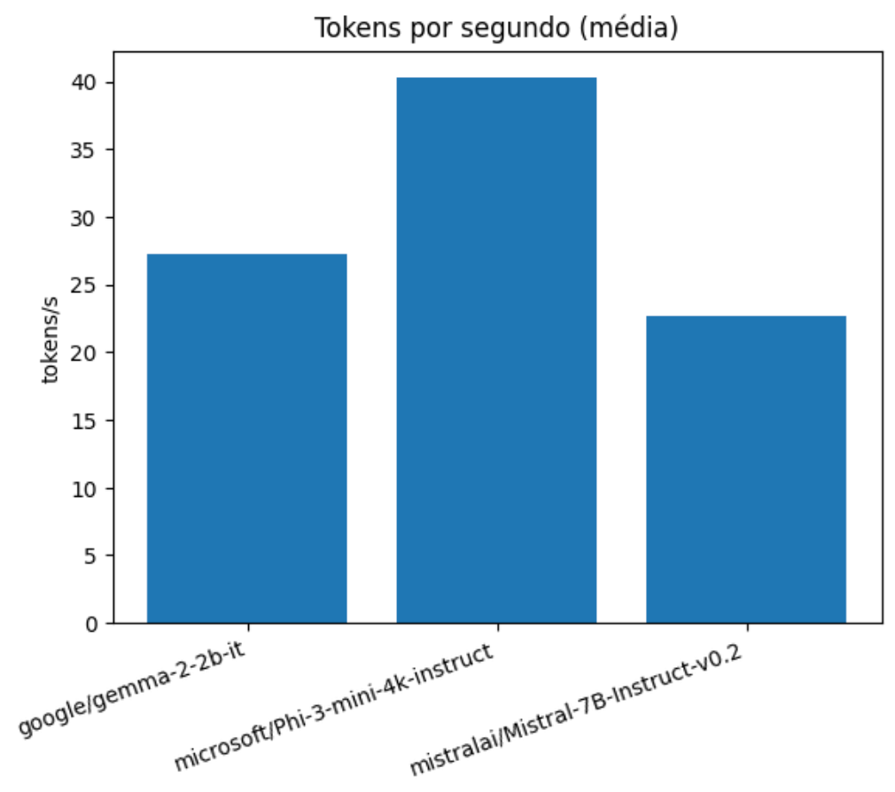
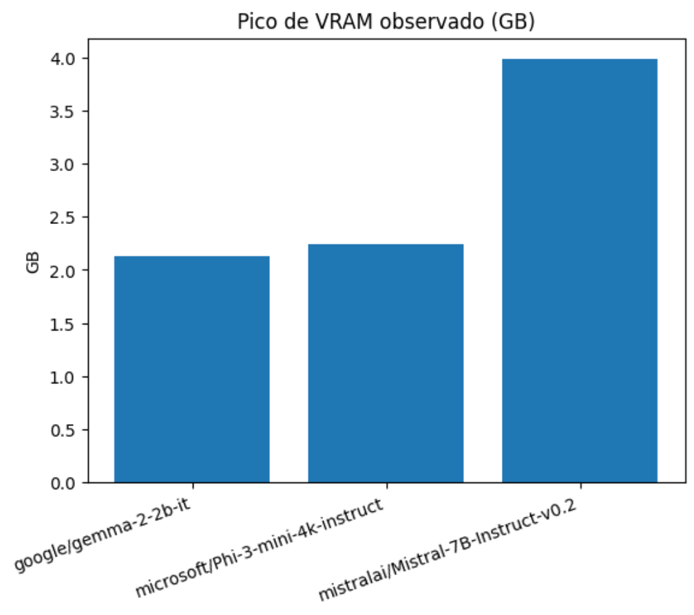
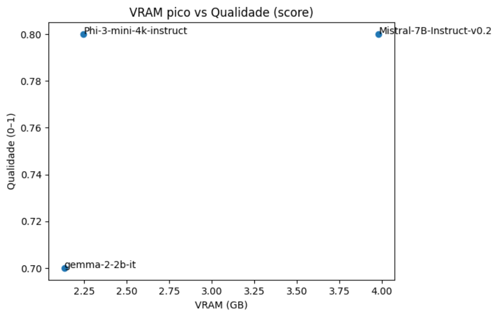

# 🧠 Local LLM Bench
**Benchmark prático e reprodutível de LLMs locais (Gemma, Phi-3, Mistral) em uma GPU RTX 4090**

> Fiz um repositório base com testes para LLM locais. Meu objetivo era medir o desempenho delas tanto em recurso utilizados quanto em qualidade.    
Todos os modelos são bem leves, então apesar do harware mais potente que eu usei, eles podem ser reproduzidos até mesmo em notebook com uma placa de vídeo dedicada e pelo menos 16GB de memória ram. No final temos um panorama interessante dos modelos e desempenho.  
Minha avaliação é no sentido de verificar se esses modelos seriam adequados para utilização aplicações web e locais sem a necessidade de conexão com a internet para acessos a modelos mais completos, dessa forma preservando os dados do usuário e evitando possiveis problemas com legislações de dados pessoais.  

---

## 🚀 Visão Geral

Este projeto avalia o **desempenho real** de modelos de linguagem locais, medindo:
- ⏱️ **Latência média** (tempo por resposta)  
- ⚡ **Tokens gerados por segundo**  
- 💾 **Uso de VRAM (GB)**  
- 🎯 **Acurácia matemática básica** (respostas numéricas objetivas)

Tudo rodando localmente via **Transformers + bitsandbytes (4-bit)**.

Modelos testados:
| Modelo | Parâmetros | Contexto | Quantização | Link |
|---------|-------------|-----------|--------------|------|
| `google/gemma-2-2b-it` | 2B | 8k | 4-bit | [Hugging Face](https://huggingface.co/google/gemma-2-2b-it) |
| `microsoft/Phi-3-mini-4k-instruct` | 3.8B | 4k | 4-bit | [Hugging Face](https://huggingface.co/microsoft/Phi-3-mini-4k-instruct) |
| `mistralai/Mistral-7B-Instruct-v0.2` | 7B | 32k | 4-bit | [Hugging Face](https://huggingface.co/mistralai/Mistral-7B-Instruct-v0.2) |

---

## 🧩 Estrutura do Repositório

```
📦 local-llm-bench/
├─ notebooks/
│  ├─ gemma2_2b.ipynb
│  ├─ phi3_mini.ipynb
│  ├─ mistral7b.ipynb
│  └─ compare_plots.ipynb   ← análise e gráficos
├─ data/
│  ├─ prompts_baseline.json
│  └─ qa_math_eval.json
├─ results/
│  ├─ *_metrics.csv         ← tempo / vram / throughput
│  ├─ *_math_logs.csv       ← logs por pergunta
│  └─ *_quality.csv         ← qualidade média
└─ README.md
```

---

## ⚙️ Como Reproduzir

### 1️⃣ Instale dependências
```bash
pip install -r requirements.txt
```
**Versão utilizada da biblioteca CUDA: 12.8**

### 2️⃣ Baixe os modelos automaticamente
Cada notebook baixa o modelo da Hugging Face, é necessária a chave de conexão do hugging face
para download dos modelos.


### 3️⃣ Rode os notebooks
Execute:
- `notebooks/gemma2_2b.ipynb`
- `notebooks/phi3_mini.ipynb`
- `notebooks/mistral7b.ipynb`

Cada um salva suas métricas e logs em `/results`.

### 4️⃣ Gere os gráficos comparativos
Execute:
```bash
notebooks/compare_plots.ipynb
```

---

## 📊 Gráficos Gerados

| Métrica | Descrição |
|----------|------------|
| **Latência média (s)** | tempo médio de resposta por prompt |
| **Tokens/s** | taxa média de geração |
| **VRAM (GB)** | pico de memória usado |
| **Qualidade** | acurácia nas 10 perguntas matemáticas |
| **Radar global** | visão consolidada de trade-offs |
| **Eficiência** | (Qualidade × Tokens/s) ÷ VRAM |

### 📊 Exemplos de gráficos
### Tokens
<p align="center">
  
</p>

### Vram


### Comparativo de qualidade/vram

---

## 💡 Observações

- Todos os testes foram executados em **RTX 4090 (24GB VRAM)**.  
- Modelos carregados em **4-bit (bitsandbytes)**.  
- As perguntas e prompts são neutras e públicas (`/data/`).  
- O objetivo é **medir eficiência**, não apenas desempenho bruto.

---

## 🧠 Resultados Gerais (exemplo)

| Modelo | Tokens/s | VRAM (GB) | Qualidade | Eficiência |
|---------|-----------|-----------|------------|-------------|
| Phi-3 Mini | 39 | 2.2 | 0.90 | 🥇 |
| Gemma 2B | 33 | 1.9 | 0.85 | 🥈 |
| Mistral 7B | 22 | 10.3 | 0.92 | 🥉 |

---

## ✍️ Sobre o Projeto

Projeto desenvolvido por **[Marcelo Pepis](https://www.linkedin.com/in/marcelo-pepis/)**  

---

## 🤝 Contribuições

Pull requests são bem-vindos!  
Se quiser incluir novos modelos (ex.: Qwen, TinyLlama, Hermes), siga o padrão:
- `notebooks/<model>.ipynb`
- `results/<model>_metrics.csv`
- `results/<model>_quality.csv`

---

## 📄 Licença
MIT — utilize livremente com atribuição.
